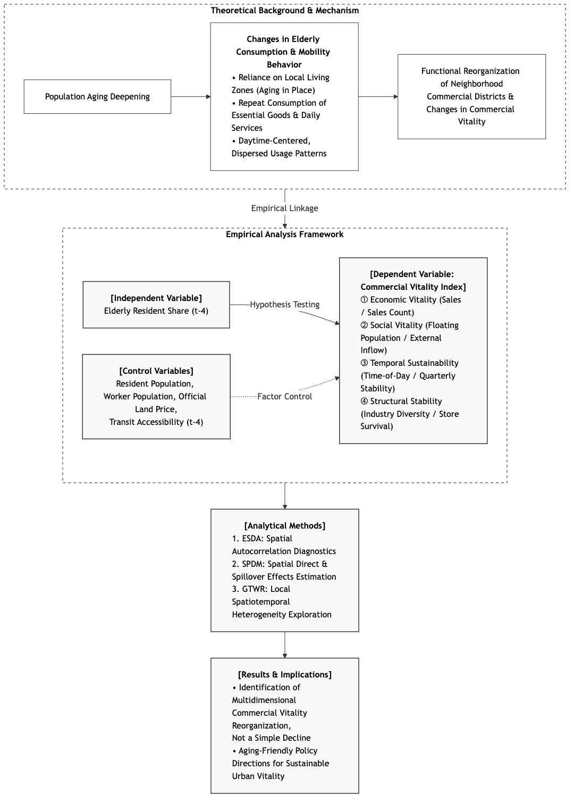

# The Impact of Population Aging on Neighborhood Commercial Vitality: A Spatiotemporal Analysis Using Seoul Big Data

This project is an analysis codebase and research specification package designed to estimate the direct and indirect impacts of population aging on the commercial vitality of neighborhood commercial districts (at the administrative-dong level) in Seoul, as well as their spatiotemporal heterogeneity.

## Research Framework

The figure below summarizes the conceptual pathway from population aging to neighborhood commercial vitality and the empirical methods used to estimate it (an English rendering of the Korean research framework figure):



> **Figure 1.** Research framework: theoretical background and mechanism (top), empirical analysis framework (middle), and analytical methods with results and implications (bottom).

---

## 1. Quick Start

This analysis uses the `here` package to automatically recognize the project root directory. To ensure reproducibility, you must start the analysis by opening the `R.Rproj` file first.

### 1.1 Package Installation

Package versions are pinned with [renv](https://rstudio.github.io/renv/) at **R 4.5.3**. `renv.lock` records the exact package versions used to run the analysis, and `.Rprofile` activates the project library automatically when the project opens in RStudio.

To restore the pinned environment (recommended for reproducibility):
```R
install.packages("renv")  # first time only
renv::restore()
```

Alternatively, to install the latest package set from CRAN without renv (less reproducible):
```R
source("02_Code/00_setup/install_packages.R")
```

### 1.2 Running the Full Pipeline
To execute the entire default pipeline—from data preprocessing to model estimation and the output of tables and figures—run the following command:
```R
source("02_Code/run_all.R")
```
Alternatively, you can run it from the terminal (Bash) as follows:
```bash
Rscript 02_Code/run_all.R
```

### 1.3 Configuration (Environment Variables)

The default pipeline runs **without any environment variables**. The following variables are only needed for optional behaviors:

| Variable | Purpose | Default |
| --- | --- | --- |
| `KAKAO_REST_API_KEY` | Kakao geocoding API key — required only when fresh geocoding beyond the existing cache is needed | *(empty)* |
| `NAVER_CLIENT_ID`, `NAVER_CLIENT_SECRET` | Naver geocoding API keys — same condition as above | *(empty)* |
| `LIVING_POP_SAMPLE_MONTHS` | Stream only a sample month (e.g. `201901`) of the Seoul Living Population for a smoke test; writes sample-tagged outputs | *(empty)* |
| `CFG_OUTPUT_TAG` | Custom suffix appended to output paths to isolate a run | *(empty)* |

> **Security note**: never commit real API keys. Set them in your local `.Renviron` file (loaded automatically by R at startup) or via `Sys.setenv()` in an untracked script.

Optional sidecar analyses (GTWR, SPDM experiments, robustness checks) expose additional environment variables (e.g. `GTWR_CONTROL_SET`, `GTWR_PARALLEL_SPECS`, `LIVING_POP_HOURS`). See [02_Code/README.md](02_Code/README.md) for the full reference.

---

## 2. Directory Structure

This repository is structured as follows to maximize research reproducibility:

```text
├── 01_Data/                  # Data for analysis (Excluded from Git tracking)
│   ├── 01_Raw_Data/          # Collected raw public data
│   ├── 02_Boundary/          # Seoul administrative-dong boundary spatial data
│   └── 03_Processed_Data/    # Preprocessed and joined analysis panel data
│
├── 02_Code/                  # Analysis pipeline scripts
│   ├── 00_setup/             # Package installation and shared configurations
│   ├── 01_preprocess/        # Quarterly panel data construction and variable/vitality index generation
│   ├── 02_esda/              # Spatial weights matrix construction and spatial autocorrelation diagnostics (Moran's I, LISA)
│   ├── 03_models/            # Panel model estimation (TWFE baseline, SPDM main, GTWR local sidecar)
│   ├── 04_robustness/        # Model robustness checks (spatial weights matrix sensitivity, etc.)
│   ├── 05_reporting/         # Generation of results tables and visualization figures
│   ├── 06_qc/                # Data contracts and model consistency quality control (QC)
│   ├── 80_optional/          # Supplementary analysis scripts such as interaction and mediation path analyses
│   ├── 90_templates/         # Execution templates for writing code
│   ├── 99_utils/             # Shared utility helper functions (.R)
│   ├── run_all.R             # Automated end-to-end pipeline execution script
│   └── README.md             # Detailed guide for the analysis code
│
├── 03_Output/                # Model estimation results, reporting tables, and figures (Excluded from Git tracking)
│   ├── 01_Tables/            # Tabular outputs (estimation models, coefficients, and diagnostics)
│   ├── 02_Figures/           # Analytical plots (coefficient plots, trend lines, etc.)
│   ├── 03_Maps/              # Spatial maps (LISA quadrant maps, emerging hotspot maps, etc.)
│   ├── 04_Logs/              # Quality control validation logs and GTWR spec/bandwidth caches
│   └── 05_report/            # Presentation-ready reports and slide-ready summaries
│
├── 04_Docs/                  # Research specifications and guidelines
│   ├── 01_Design/            # Research plan and procedural manual (incl. English research framework figure)
│   └── 02_Codebook/          # Specifications mapping data specs, variable dictionary, and model specs
│
├── .Rprofile                 # Activates the renv project library on startup
├── .gitignore                # Git ignore rules (data, outputs, secrets, renv library)
├── LICENSE                   # MIT license
├── README.md                 # This main guide document
├── renv.lock                 # Pinned package versions for reproducible environment (renv)
├── renv/                     # renv project library (auto-managed; library/ is gitignored)
└── R.Rproj                   # RStudio project file
```

---

## 3. Data Availability

The original data used in this study are **public open data** from Korean government agencies and are **not included in this repository** because of their large size (50+ GB) and public-data terms of use. The analysis code is fully reproducible once the raw data are placed in `01_Data/`.

### 3.1 Where to Obtain the Raw Data

| Source | Portal / Download |
| --- | --- |
| Seoul Commercial District Analysis Service (sales, stores, floating population, survival rates) | [golmok.seoul.go.kr](https://golmok.seoul.go.kr/) / [data.seoul.go.kr](https://data.seoul.go.kr/) |
| Seoul Living Population (internal movement, metro area) | [data.seoul.go.kr](https://data.seoul.go.kr/) |
| MOIS Resident Registration Population (5-year age groups by dong) | [jumin.mois.go.kr](https://jumin.mois.go.kr/) |
| Seoul business status by worker size, apartments, large retail stores, hospitals, subway stations, bus stops | [data.seoul.go.kr](https://data.seoul.go.kr/) |
| Official land prices, facilities, pedestrian environment | [vworld.kr](https://www.vworld.kr/) / [localdata.go.kr](https://www.localdata.go.kr/) |
| 2020 Seoul administrative dong boundaries | [SGIS](https://sgis.kostat.go.kr/) |

Detailed dataset-level specifications (source names, download URLs, granularity, temporal coverage, access dates, versions, and QC rules) are documented in:
* **Data Specification**: [01_data_spec.md](04_Docs/02_Codebook/01_data_spec.md)
* **Machine-readable dataset catalog**: [01_data_spec_datasets.csv](04_Docs/02_Codebook/01_data_spec_datasets.csv)

### 3.2 Acquisition Record and Integrity

Every raw file is cataloged with its access date (file mtime), embedded version timestamp, size, and MD5 checksum in:
* **Raw data manifest**: [raw_data_manifest.csv](04_Docs/01_Design/raw_data_manifest.csv)

> **Note**: `01_Data/**` and `03_Output/**` are excluded from Git tracking (see `.gitignore`). Reproducing the pipeline requires obtaining the raw data from the sources above; the manifest and codebook document exactly which files the analysis expects and how to verify them.

---

## 4. Documentation Reference

For detailed theoretical backgrounds, variable definitions, and model equations of the research, please refer to the following documents:

* **Research Plan Summary**: [research_plan.md](04_Docs/01_Design/research_plan.md)
* **Step-by-step Procedure**: [research_procedure.md](04_Docs/01_Design/research_procedure.md)
* **Project File Tree**: [file_tree.md](04_Docs/01_Design/file_tree.md)
---

## 5. Interactive GTWR Explorer

본 연구의 시공간 지리가중회귀(GTWR) 국지적 추정치와 서울시 425개 행정동별 25개 분기(2019Q4–2025Q4) 시계열 궤적을 인터랙티브하게 탐색할 수 있는 웹 애플리케이션을 제공합니다:

👉 **[Seoul Aging & Commercial Vitality GTWR Explorer 열기](https://slowpacer9504.github.io/aging-commercial-vitality-seoul/)**

* **핵심 기능**:
  * 🗺️ **425개 행정동 공간 Choropleth**: 5대 상권 활력 지표별 국지적 고령화 영향($\hat{\beta}$) 분포 및 다공선성(Condition Number) 진단.
  * ⏱️ **25분기 시공간 타임라인**: 2019Q4부터 2025Q4까지 시공간 궤적 슬라이더 및 자동 재생.
  * 💡 **논문 핵심 발견 가이드 투어 (Guided Tour)**: 동북권의 광범위한 활력 고진 및 강남 GBD 업무지구 vs 외곽 주거지의 상반된 공간 양극화 등 핵심 연구 결과 인터랙티브 해설.
  * 🔍 **25개 자치구 필터 & 듀얼 행정동 비교**: 행정동 간 side-by-side 메트릭 비교 및 시계열 오버레이 차트.
  * 📈 **진단 산점도 Brushing & Linking**: 국지적 다공선성(CN)과 계수($\hat{\beta}$) 간의 양방향 인터랙티브 연동.
  * 📥 **연구 데이터 내보내기**: 고해상도 지도 이미지(PNG), 계수 및 25분기 패널 데이터(CSV) 다운로드, URL 딥링크 공유.
  * 🌙 **다크 테마 (CartoDB Dark Matter)**: 발표 및 야간 연구 환경 최적화.

---

## License

This project is licensed under the [MIT License](LICENSE).

